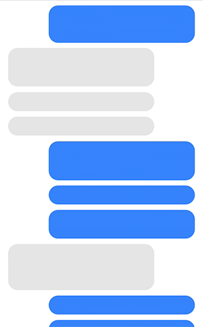
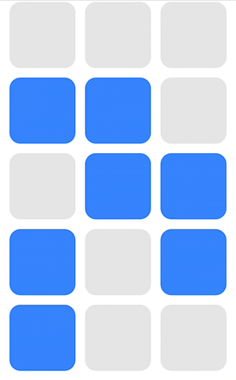
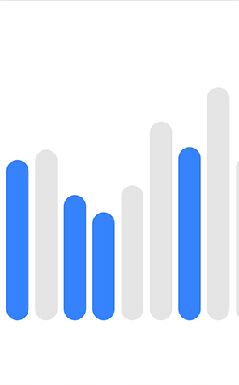

**tl;dr** *Make. It. Bounce.*

**BouncyLayout** is a collection view layout that makes your cells bounce.



## Features

- [X] Works with every `UICollectionView`.
- [X] No configuration needed.
- [X] Horizontal and vertical scrolling support.

## Setup
The only you thing you need to do is import `BouncyLayout`, create an instance and add it to your `UICollectionView`.
```swift
import BouncyLayout
```
```swift
let layout = BouncyLayout()
```
```swift
UICollectionView(frame: .zero, collectionViewLayout: layout)
```

##### Find the above displayed examples in the `example` folder.

## Installation

### CocoaPods

BouncyLayout is available through [CocoaPods](http://cocoapods.org). To install
it, simply add the following line to your Podfile:

```ruby
pod "BouncyLayout"
```

### Carthage

BouncyLayout is available through [Carthage](https://github.com/Carthage/Carthage). To install
it, simply add the following line to your Cartfile:

```
github "roberthein/BouncyLayout"
```

## Suggestions or feedback?

Feel free to create a pull request, open an issue or find me [on Twitter](https://twitter.com/roberthein).
